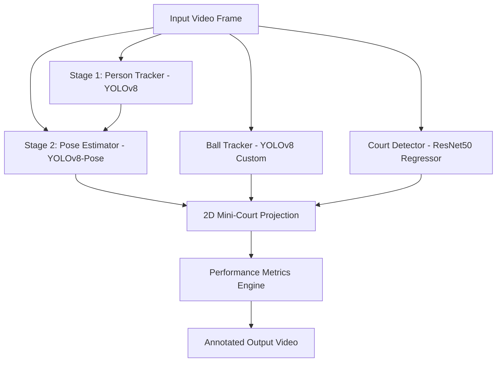

# 🎾 Tennis Analysis Using YOLO & Deep Learning

An advanced computer vision and deep learning pipeline designed to perform comprehensive performance analysis on tennis matches from raw video input. This system tracks players and the ball, detects court keypoints, maps players onto a 2D mini-court, and extracts key match statistics—including player speed, ball shot speed, and hitting hand detection.

---

## 🏗️ Architecture & Pipeline Flow

The pipeline processes video frames sequentially through detection, projection, analysis, and rendering steps:



---

## 🌟 Key Features

### 1. Two-Stage Player Tracking & Pose Estimation
* **The Problem:** Standard pose detection models fail on players far from the camera due to low resolution and joint scaling issues.
* **The Solution:** We implement a robust **two-stage pipeline**:
  1. Detect the player's bounding box using standard YOLOv8 at high resolution (`imgsz=1920`).
  2. Crop the detected region with dynamic padding and run a specialized `YOLOv8-Pose` model. This allows high-precision skeleton keypoint tracking regardless of the player's distance.

### 2. Ball Tracking & Trajectory Interpolation
* **The Problem:** Fast-moving tennis balls often appear blurred or vanish for a few frames.
* **The Solution:** The `BallTracker` utilizes custom YOLOv8 detection combined with **Pandas-based interpolation** (`ffill` / `bfill` / linear) to reconstruct missing trajectory points, followed by a rolling mean filter to identify bounce and hit event frames.

### 3. Deep-Learning Court Keypoint Regression
* Leverages a custom-trained **ResNet50 regressor** mapped to 14 distinct tennis court keypoints.
* Uses the keypoints to calculate perspective homography, allowing mapping from 3D camera space to a standardized flat 2D layout.

### 4. 2D Mini-Court Perspective Projection
* Transports pixel-space coordinates into metric-space (meters).
* Computes real-world distances traveled by players and the ball, projecting them onto a clean 2.5D visual minimap overlaid directly onto the video.

### 5. Advanced Match Analytics
* **Shot Speed:** Measures ball displacement across hits in real-world meters over time to compute shot speed in km/h.
* **Player Velocity:** Measures player movement speed across shots.
* **Hitting Hand Detection:** Analyzes the physical proximity of the player's left and right wrist joint keypoints (joints `9` and `10`) to the ball at the moment of impact to determine if the shot was a forehand/backhand hit with the Left or Right hand.

---

## 📁 Repository Structure

```text
├── constants/               # Court dimension values and physical metrics
├── court_lines/             # ResNet50 court keypoint detector code
├── input_video/             # [Ignored] Raw input videos
├── mini_court/              # Mini-court rendering and mapping math
├── models/                  # Custom trained PyTorch and YOLO models
│   └── put_models_here.txt  # Instructions for local model setup
├── output_video/            # [Ignored] Annotated output video location
├── tracker_stubs/           # [Ignored] Saved pickle stubs for faster debugging
├── trackers/                # Player and Ball YOLOv8 tracking modules
├── training/                # Jupyter Notebooks for model training
├── utils/                   # Video, bounding box, and geometry helpers
├── main.py                  # Main execution script
├── requirements.txt         # Project package dependencies
└── .gitignore               # Safe Git tracking configuration
```

---

## 🚀 Getting Started

### 1. Prerequisites
Ensure you have Python 3.8+ and `nvcc` (if running with GPU acceleration) installed.

### 2. Installation
Clone the repository and install the dependencies:
```bash
pip install -r requirements.txt
```

### 3. Model Weights Setup
Download the required model weights and place them as follows:
* **Detection weights** (`yolo26m.pt`, `yolo26m-pose.pt`) placed in the root directory.
* **Trained ball tracker** (`best.pt`) and **court line model** (`coord.pt`) placed in the `models/` directory.

### 4. Run the Pipeline
Ensure you have an input video at `input_video/input_video.mp4`, then run the main entry point:
```bash
python main.py
```
The annotated output video will be generated at `output_video/output_video.avi` showing the players' bounding boxes, pose skeletons, court keypoints, 2D minimap, and active stats scoreboard.
